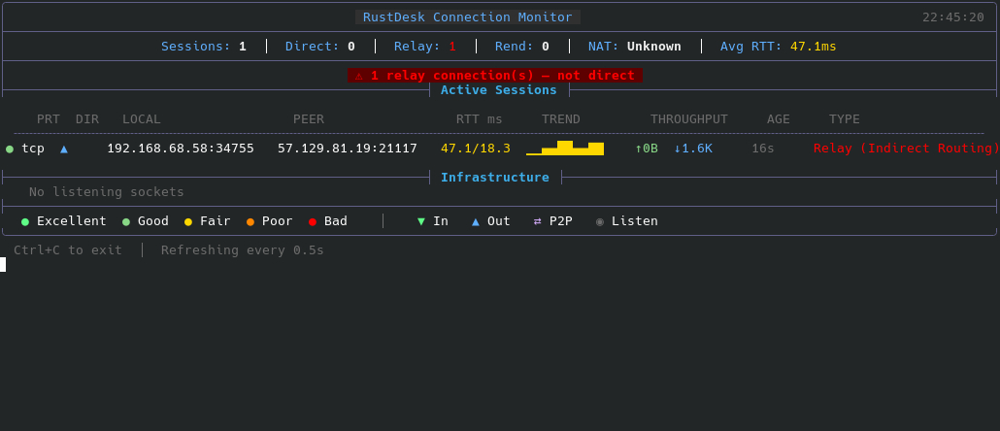

# RustDesk Connection Monitor

A real-time, terminal-based dashboard for monitoring RustDesk connections. This script parses standard Linux network connections (`ss`) and your `RustDesk2.toml` configuration to give you a highly polished, live overview of your active remote desktop sessions.



> **Note:** This tool was originally vibecoded via Google Antigravity as an ad-hoc one-time solution. However, since it proved incredibly useful (and other people asked for it!), it's been published here.

## Features

* **Zero Dependencies:** Runs on pure Python 3.x and `iproute2` (`ss`). No `pip install` required.
* **Auto-Discovery:** Automatically reads your `RustDesk2.toml` to detect custom direct-access ports and NAT settings.
* **Live Throughput:** Calculates live `↑ tx` and `↓ rx` rates across active relay, rendezvous, and direct connections.
* **Real-time Diagnostics:**
  * Displays moving-average RTT (latency) and jitter.
  * Visual Unicode sparklines for latency trends.
  * Grades connection health from A to F based on network performance.
* **Smart UI Layout:** Uses an ANSI-aware layout engine that scales precisely to your terminal width, beautifully handling everything from compact views to ultra-wide, dual IPv6 connection addresses.
* **Headless / Logging Mode:** Supports `--json` or `--log` output for ingestion into Grafana, FluentBit, or other pipelines.

## Installation

Because it is a single standalone file, installation is as simple as downloading it and making it executable:

```bash
git clone https://github.com/SoongVilda/rustdesk-monitor.git
cd rustdesk-monitor
python3 build.py
sudo install -m 755 rustdesk-monitor.py /usr/local/bin/rustdesk-monitor
```

*(Note: It is perfectly fine to omit the `sudo install` command and run the compiled script directly from the repository directory without moving it to your path.)*

## Architecture & Unix Philosophy

The codebase has been structured to adhere strictly to the **Unix Philosophy**, particularly emphasizing the *Rule of Modularity* and the *Rule of Separation*.

To achieve this while maintaining a "zero dependencies" and single-file download for users, the source code is broken down into separate modules located in the `src/` directory:
* `src/config.py` - Configuration loading (Data)
* `src/parser.py` - Interfacing with `ss` and extracting connection info (Mechanism)
* `src/tracker.py` - State tracking, health, and alerting (Logic)
* `src/ui.py` - Terminal rendering and layout (Policy)
* `src/main.py` - CLI orchestration

**For Developers:** Do not edit `rustdesk-monitor.py` directly. Instead, modify the files in `src/` and then run `./build.py` to compile the single-file distribution script. This approach yields the maintainability of a multi-file Python package while preserving the portability of a standalone script.

## Usage

Simply run the compiled script in your terminal:

```bash
rustdesk-monitor
```

> [!TIP]
> If you want to monitor the system-wide RustDesk service, you may need to run the script with `sudo` so that `ss` can access process names and PIDs.

The UI refreshes every 0.5s by default. Press `Ctrl+C` to exit.

### Available Options

* `-p`, `--port`: Specify a custom direct access port if you are using a branded client and the config reader fails.
* `-r`, `--refresh`: Set the refresh interval in seconds (default: 0.5).
* `--json`: Print a one-off JSON snapshot of the current connections.
* `--log`: Run continuously, outputting NDJSON (New-line Delimited JSON) for piping to log aggregators.

## How it works

The monitor relies on standard Linux utilities. It uses `ss -tin` to gather socket statistics, extracting byte counts, RTT, and connection states. It maps the active ports back to RustDesk's internal network architecture:
* `21114` - API Server
* `21116` - Rendezvous (Signaling)
* `21117` - Relay
* `21118` - Direct Access (or WS Rendezvous)
* `21119` - LAN Discovery

## Compatibility

Designed and tested on Linux (specifically Arch/CachyOS). It works out of the box on Debian, Ubuntu, Fedora, and any distribution that provides `iproute2`.

## Contributing

Feel free to fork and open pull requests if you want to add new features!
