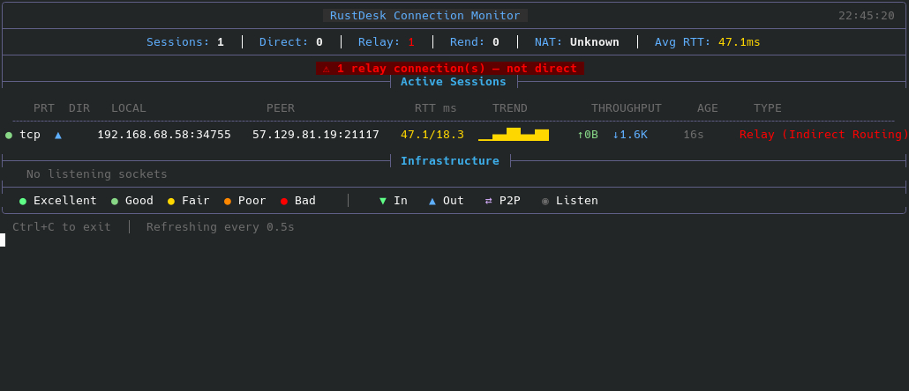

# RustDesk Connection Monitor

A real-time, terminal-based dashboard for monitoring RustDesk connections. This script parses standard Linux network connections (`ss`) and your `RustDesk2.toml` configuration to give you a highly polished, live overview of your active remote desktop sessions.



> **Note:** This tool was originally vibecoded via Google Antigravity as an ad-hoc one-time solution. However, since it proved incredibly useful (and other people asked for it!), it's been published here.

## Features

* **Zero Dependencies:** Runs on pure Python 3.x and `iproute2` (`ss`). No `pip install` required.
* **Auto-Discovery:** Automatically reads your `RustDesk2.toml` to detect custom direct-access ports and NAT settings.
* **Live Throughput:** Calculates live `↑ tx` and `↓ rx` rates across active relay, rendezvous, and direct connections.
* **Real-time Diagnostics:**
  * Displays moving-average RTT (latency) and jitter.
  * Visual Unicode sparklines for latency trends.
  * Grades connection health from A to F based on network performance.
* **Smart UI Layout:** Uses an ANSI-aware layout engine that scales precisely to your terminal width, beautifully handling everything from compact views to ultra-wide, dual IPv6 connection addresses.
* **Headless / Logging Mode:** Supports `--json` or `--log` output for ingestion into Grafana, FluentBit, or other pipelines.

## Installation

Because it is a single standalone file, installation is as simple as downloading it and making it executable:

```bash
git clone https://github.com/SoongVilda/rustdesk-monitor.git
cd rustdesk-monitor
python3 build.py
sudo install -m 755 rustdesk-monitor.py /usr/local/bin/rustdesk-monitor
```

*(Note: It is perfectly fine to omit the `sudo install` command and run the compiled script directly from the repository directory without moving it to your path.)*

## Architecture & Unix Philosophy

The source separates configuration, socket collection, connection tracking, and terminal rendering. The build combines these modules into one standalone script with no third-party Python dependencies.

To achieve this while maintaining a "zero dependencies" and single-file download for users, the source code is broken down into separate modules located in the `src/` directory:
* `src/config.py` - Configuration loading (Data)
* `src/parser.py` - Interfacing with `ss` and extracting connection info (Mechanism)
* `src/tracker.py` - State tracking, health, and alerting (Logic)
* `src/ui.py` - Terminal rendering and layout (Policy)
* `src/main.py` - CLI orchestration

**For Developers:** Do not edit `rustdesk-monitor.py` directly. Instead, modify the files in `src/` and then run `./build.py` to compile the single-file distribution script. This approach yields the maintainability of a multi-file Python package while preserving the portability of a standalone script.

## Usage

Simply run the compiled script in your terminal:

```bash
rustdesk-monitor
```

> [!TIP]
> If you want to monitor the system-wide RustDesk service, you may need to run the script with `sudo` so that `ss` can access process names and PIDs.

The UI refreshes every 0.5s by default. Press `Ctrl+C` to exit.
`--watch` accepts finite numbers of seconds; values below 0.1 are clamped to 0.1.
If `ss` is missing or fails, the monitor reports the error on stderr and exits
with status 1 instead of reporting an empty successful snapshot.

### Available Options

```text
usage: rustdesk-monitor [-h] [-j] [-w SECS] [-p NAME] [--log FILE]

RustDesk Connection Monitor v4.0 — real-time dashboard with throughput,
RTT sparklines, health grading, and connection tracking.

options:
  -h, --help            show this help message and exit
  -j, --json            JSON output (single shot, or NDJSON with --watch)
  -w SECS, --watch SECS
                        Refresh interval (default: 0.5 for TTY)
  -p NAME, --process-name NAME
                        Process name to filter (default: rustdesk)
  --log FILE            Append NDJSON records to FILE alongside dashboard

EXAMPLES:
  rustdesk-monitor                     Interactive dashboard
  rustdesk-monitor -j | jq             JSON snapshot
  rustdesk-monitor -j -w 1             NDJSON stream every 1s
  rustdesk-monitor -w 0.25             Fast 250ms refresh
  rustdesk-monitor --log conn.jsonl    Dashboard + append to log file
  rustdesk-monitor -p mydesk           Custom-branded client
```

## How it works

The monitor uses `ss -atuipn` to gather TCP and UDP sockets, including listeners,
with numeric addresses, process details, and available TCP statistics. It maps
the active ports back to RustDesk's internal network architecture:
* `21114` - API Server
* `21116` - Rendezvous (Signaling)
* `21117` - Relay
* `21118` - Direct Access (or WS Rendezvous)
* `21119` - WS Relay

These are the standard server ports; see the [RustDesk server documentation](https://rustdesk.com/docs/en/self-host/rustdesk-server-oss/install/).
The direct-access port is read from `RustDesk2.toml` when configured. Unavailable
traffic counters remain unknown (`null` in JSON, `—` in the dashboard); TX and RX
rates are calculated independently when consecutive samples have the needed counter.

## Compatibility

Designed and tested on Linux (specifically Arch/CachyOS). It works out of the box on Debian, Ubuntu, Fedora, and any distribution that provides `iproute2`.

## Testing

To maintain the strict "Zero Dependencies" policy, the test suite relies solely on the standard library's `unittest` module.

The tests are designed to verify both the individual source modules located in the `src/` directory and the final compiled single-file distribution (`rustdesk-monitor.py`). This ensures behavioral consistency regardless of how the code is executed.

After editing `src/`, rebuild the standalone script and run the test suite:

```bash
python3 build.py
python3 -m unittest discover -s tests
```

Commit the regenerated `rustdesk-monitor.py` alongside source changes. GitHub
Actions runs the tests on Python 3.10 and 3.14 and checks that rebuilding leaves
the committed standalone script unchanged. Both CLI entry points are also checked
with `--help`.

## Contributing

Feel free to fork and open pull requests if you want to add new features!
